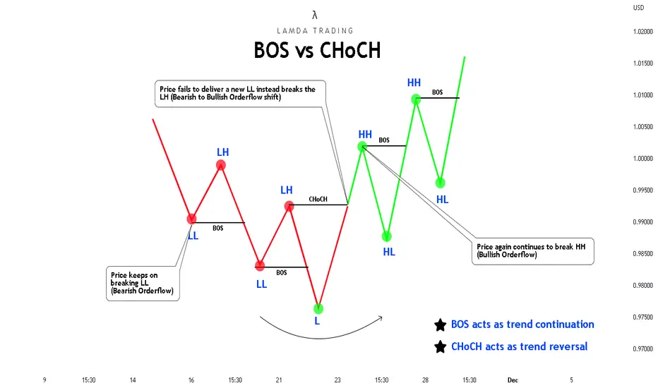
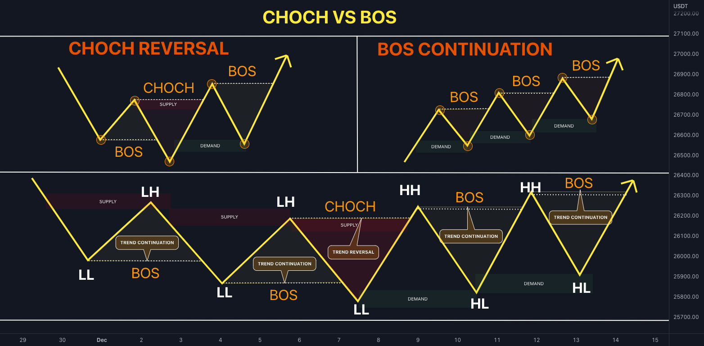
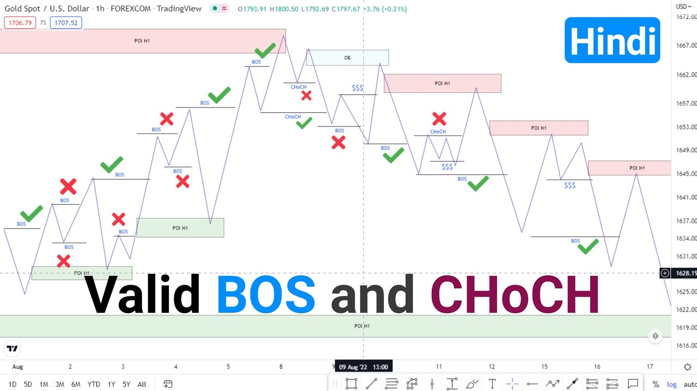
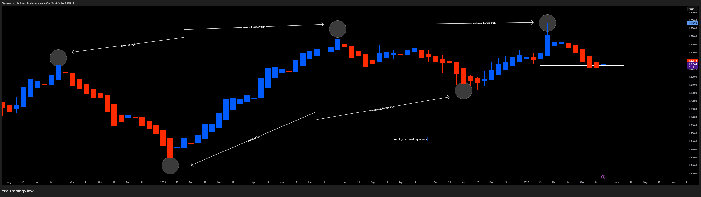
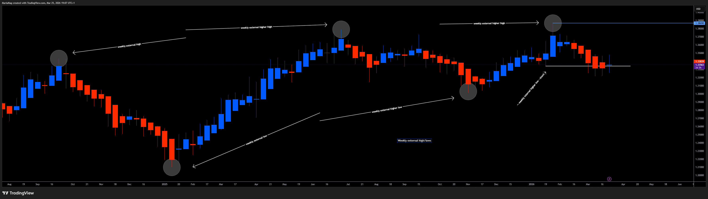
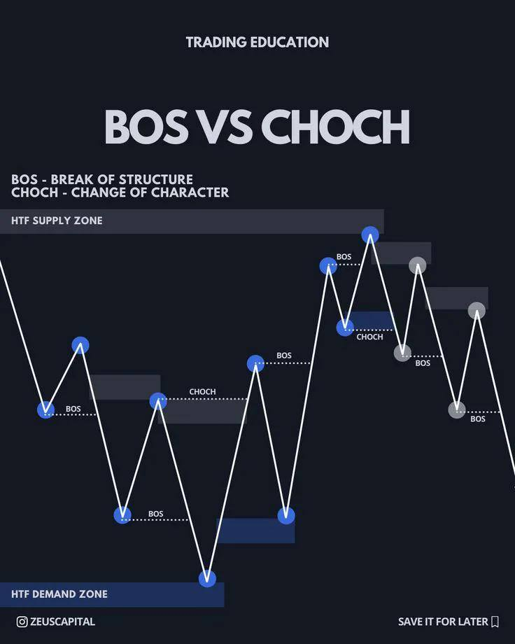
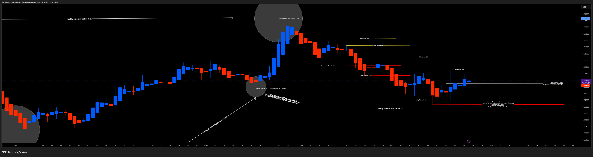
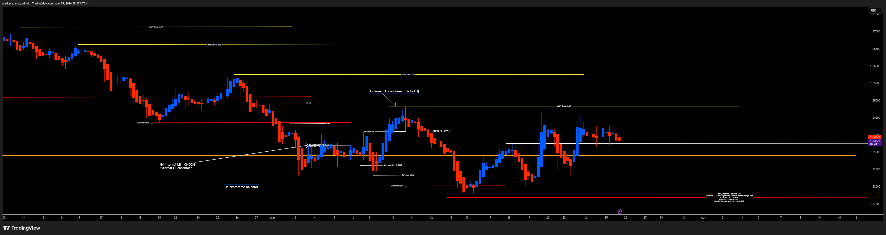

# 01 — Market Structure (BOS / CHoCH)

> Indicator: `iora_structure.pine`
> Describes how the system detects trend continuation and reversal across 8 timeframes.
> Also plots breaker zones and persisted H4 zones (see `03_breaker_mitigation.md`).

---

## What This Indicator Plots

Horizontal **structure lines** on the chart showing where zones were broken, classified as:

- **BOS** (Break of Structure) — trend continuation, solid line, green
- **CHoCH** (Change of Character) — reversal signal, dashed line, red

Each line is labeled with the timeframe and whether it is **internal** (current TF) or **external** (parent TF break detected on child TF).

Example label: `M15 iBOS` (M15 internal break of structure) or `H1 eCHoCH` (H1 external change of character).

---

## Core Concepts

### Three Market States

Every timeframe is always in one of three states:

| State | Definition |
|-------|-----------|
| **Uptrend** | Making HH after HH (higher highs) |
| **Downtrend** | Making LL after LL (lower lows) |
| **Reversal / Neutral** | CHoCH fired but BOS in new direction not yet confirmed |

### Internal vs External Structure

This is the most important distinction in the system.

- **Internal structure** = zone breaks on the current timeframe. These are the sub-swings within a trend.
- **External structure** = a child TF detects that a parent TF zone has been broken. This is the true structural boundary.

The parent-child chain: M1→M5→M15→H1→H4→D→W→MN. Each TF checks the next higher TF's zones for external breaks.

**Collapsing internal and external into one layer is the #1 cause of false signals.**

---

## Detection Rules

### Zone Break = Body Close Only

A zone is broken **only** when price body-closes through it. Wicks through a zone are treated as **liquidity sweeps**, not structural breaks.

- Supply zone broken: `close > zone.top`
- Demand zone broken: `close < zone.bottom`

### Bias Tracking

Each timeframe maintains a directional **bias**:

| Bias | Value | Meaning |
|------|-------|---------|
| Bullish | `+1` | Last break was through a supply zone (upward) |
| Bearish | `-1` | Last break was through a demand zone (downward) |
| Neutral | `0` | No breaks yet |

Bias is updated on every zone break. External breaks take precedence over internal.

### BOS vs CHoCH Classification

The classification depends on the **pre-break bias** — the bias *before* the current break updates it:

| Break Direction | Pre-Break Bias | Result |
|----------------|----------------|--------|
| Bullish (supply broken) | Bullish or Neutral | **BOS** — trend continues |
| Bullish (supply broken) | Bearish | **CHoCH** — reversal signal |
| Bearish (demand broken) | Bearish or Neutral | **BOS** — trend continues |
| Bearish (demand broken) | Bullish | **CHoCH** — reversal signal |

**Key**: The pre-break bias is captured *before* the break updates it. This prevents the break from classifying itself.

---

## External Break Detection

External breaks are detected by checking whether price on the **child TF** body-closes through zones stored in the **parent TF** zone array.

When an external break fires:
1. A thicker (width 2) structure line is drawn, labeled with `e` prefix (e.g., `H1 eBOS`)
2. The bias for that TF is updated (external takes precedence)
3. All internal structure lines since the last external event are optionally cleared

This provides the cascade: a M15 external break means an H1 zone was consumed. You see the structural shift *before* the H1 candle closes.

---

## Visual Spec

| Element | Style | Color |
|---------|-------|-------|
| Internal BOS line | Solid, width 1 | Green `#4CAF50` |
| Internal CHoCH line | Dashed, width 1 | Red `#F44336` |
| External BOS line | Solid, width 2 | Green `#4CAF50` |
| External CHoCH line | Dashed, width 2 | Red `#F44336` |
| Label | Tiny text, no background | Matches line color |

Labels are placed along the line between origin and break point. External labels use `label_up` style, internal use `label_down`.

---

## Configuration

| Input | Default | Description |
|-------|---------|-------------|
| Timeframes (M1–MN) | M5, M15, H1, H4 on | Which TFs to detect structure on |
| Zone Age per TF | 50 bars (M1–H4), 30 (W), 20 (MN) | Max age before zones expire |
| Doji Body % | 5.0 | Threshold for doji classification in HA detection |
| Max Lines Per TF | 3 | Cap on simultaneous structure lines per TF |
| Show Since Last External | On | Clear internal lines when external event fires |

---

## How It Works (Implementation Summary)

1. **HA detection** runs on each enabled TF via `request.security()` — identifies red→blue (demand) and blue→red (supply) transitions
2. Zones are stored as lightweight objects (no boxes drawn) — only used for break detection
3. On each bar, zones are checked for body-close breaks. Broken zones are flagged and removed.
4. Break events are classified as BOS or CHoCH using the pre-break bias
5. Structure lines are drawn from the zone's origin time to the break bar
6. External breaks check the parent TF's zone array for the same body-close condition
7. Bias updates: internal first, then external (external overrides)

