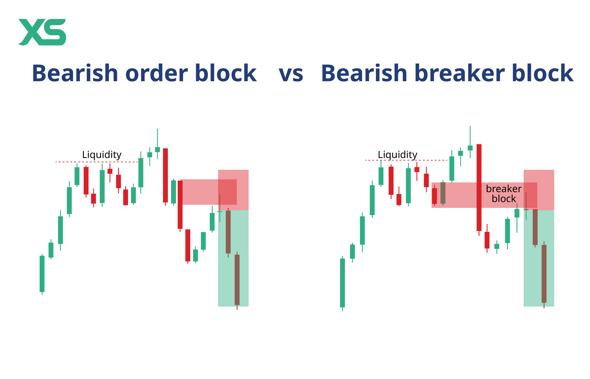
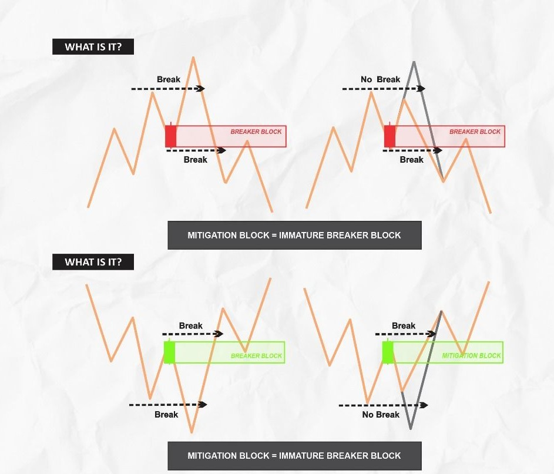
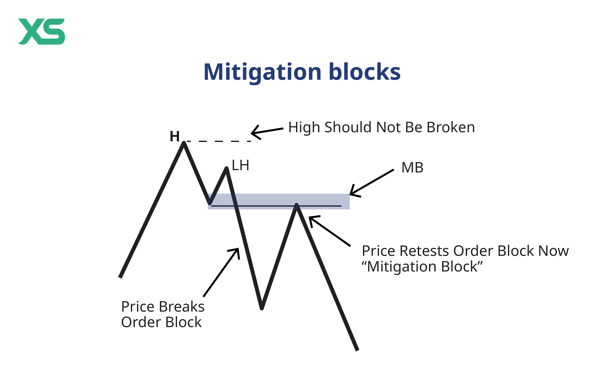
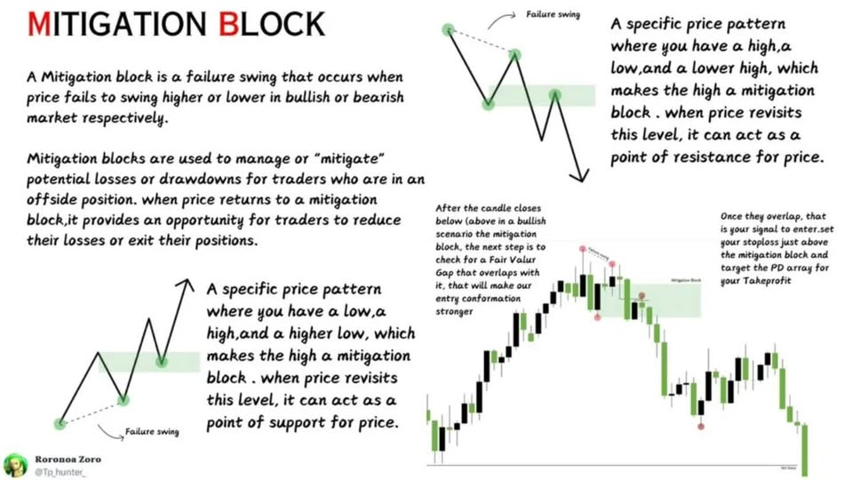

# 03 — Breaker & Mitigation Blocks

> Indicator: `iora_structure.pine` (breaker + persisted zone logic merged into the structure indicator)
> Describes how broken zones flip polarity and become breaker blocks, and the distinction between breaker and mitigation mechanics.

---

## What This Indicator Plots

- **Breaker zone boxes**: dashed-border rectangles showing where a broken zone has flipped polarity
  - Cyan fill = was a supply zone (now acts as demand/support on retest)
  - Red fill = was a demand zone (now acts as supply/resistance on retest)
- **Persisted H4 zones**: the last unbroken H4 supply/demand zone captured at the moment an external BOS fires
  - Orange dashed border = persisted H4 supply (pre-eBOS context)
  - Blue dashed border = persisted H4 demand (pre-eBOS context)



---

## Core Concept: Zone Polarity Flip

When a zone is broken by a structural event (external BOS), it doesn't disappear — it **flips polarity**:

| Original Zone | Broken By | Becomes | Acts As |
|--------------|-----------|---------|---------|
| Supply (sellers) | Bullish eBOS (close > supply top) | **Bullish breaker** | Support on retest from above |
| Demand (buyers) | Bearish eBOS (close < demand bot) | **Bearish breaker** | Resistance on retest from below |

The key insight: the broken zone area still contains unfilled orders. The institutional participants who were positioned there now have trapped orders that create a reaction zone when price returns.



---

## Breaker Block

### Definition

A breaker block is created when an **external HH/LL break** fires — meaning a child TF has body-closed through a parent TF zone. The original zone area becomes the breaker.

### Formation Trigger

The breaker fires specifically on **external breaks where the broken zone was classified HH or LL** (structural zones, not corrective). This ensures breakers only form on meaningful structural events, not minor corrections.

### What Gets Plotted

When an external HH/LL break fires:
1. A box is drawn from the broken zone's origin time to the break bar
2. The box spans `zone.top` to `zone.bottom` (same area as the original zone)
3. Labeled: `{TF} BRK {S|D}` — e.g., "M15 BRK S" (M15 breaker, was supply)
4. Extends right until retested or replaced

### Breaker Removal

A breaker is removed **only** when:

1. **Retested** — price body-closes inside the zone (`close >= zone.bottom AND close <= zone.top`)
2. **Count overflow** — more than max breakers per TF (oldest removed, configurable, default 3)

A breaker is **never** removed by:
- Time decay or bar age limits
- Lower TF events
- Zone expiry rules

### Why Breakers Must Persist

The breaker zone serves two critical purposes:

1. **Exit target** — a reversal trade (e.g., long from terminal demand) rides TO the breaker zone
2. **Entry zone** — the next directional trade (e.g., D LH short) forms AT the breaker zone

Removing the breaker prematurely loses both the exit target and the re-entry zone.

---

## Breaker vs Mitigation Block

The type of structural break determines whether the zone becomes a breaker or mitigation block:

| Aspect | Breaker Block | Mitigation Block |
|--------|--------------|-----------------|
| **Formation** | Full structural reversal (CHoCH + BOS in new direction) with liquidity sweep | Failure swing — reversal without full structural break, no liquidity grab |
| **Trigger** | External HH/LL break (eBOS) | Zone broken without external confirmation |
| **Reaction Strength** | Strong — higher probability of holding | Moderate — typically one retest |
| **Persistence** | Until retested or count overflow | Shorter-lived, standard zone lifecycle |
| **Entry Quality** | High conviction | Medium conviction |





### Mechanical Distinction

The **type of break** determines the block type:

- **Breaker**: The zone was broken by a move that also swept liquidity (BSL/SSL) and produced a full structural reversal. The broken zone's polarity flips because the trapped orders from the sweep create the reaction.
- **Mitigation**: The zone was broken by a failure swing — price couldn't continue in the trend direction but didn't produce a full reversal. No liquidity grab preceded the break.

---

## Persisted H4 Zones (Pre-eBOS Context)

### What They Are

When an external BOS fires on H4, the indicator captures the **last unbroken H4 zone** that existed just before the break. This provides reversal context:

| External Event | Persisted Zone | Purpose |
|---------------|---------------|---------|
| Bearish eBOS (H4 breaks D demand downward) | Last unbroken H4 **supply** before the break | Shows where sellers were positioned before the structural break — potential reversal target |
| Bullish eBOS (H4 breaks D supply upward) | Last unbroken H4 **demand** before the break | Shows where buyers were positioned before the structural break — potential reversal target |

Also triggers on strong internal breaks: H4 iBOS where the broken zone was HH/LL classified.

### Visual Spec

| Element | Style |
|---------|-------|
| Persisted supply box | Orange `#FF6D00` dashed border, width 2, 85% transparent fill |
| Persisted demand box | Blue `#2979FF` dashed border, width 2, 85% transparent fill |
| Label | `H4 S (pre-eBOS)` or `H4 D (pre-eBOS)` |

### Persisted Zone Removal

Removed when:
1. **Body-close break** — price closes through the zone (supply: `close > top`, demand: `close < bottom`)
2. **Replaced** — a new external break creates a new persisted zone of the same type

---

## The Complete Zone Lifecycle

Combining all three specs, a zone moves through this lifecycle:

```
1. CREATED      — HA color transition fires, zone box drawn (02_supply_demand_zones)
2. ACTIVE       — Zone extends right, waiting for interaction
3. BROKEN       — Body close through zone (02_supply_demand_zones)
   ├── If external HH/LL break:
   │   ├── Zone deleted from active array
   │   ├── BREAKER created at same area (flipped polarity)
   │   └── Pre-eBOS persisted zone captured
   └── If internal break or non-HH/LL:
       └── Zone deleted immediately
4. BREAKER      — Persists until retested
5. RETESTED     — Body close inside breaker → breaker deleted
```

---

## Configuration

| Input | Default | Description |
|-------|---------|-------------|
| Timeframes (M1–MN) | M5, M15, H1, H4 on | Which TFs to track |
| Zone Age per TF | 50 bars (M1–H4), 30 (W), 20 (MN) | Zone expiry |
| Doji Body % | 5.0 | HA doji threshold |
| Show Breakers | On | Toggle breaker box display |
| Max Breakers Per TF | 3 | Cap on simultaneous breaker boxes per TF |
| Persist H4 Zones Before eBOS | On | Toggle persisted zone capture |

---

## How It Works (Implementation Summary)

1. **Zone detection + management** identical to `iora_structure.pine` — lightweight zones (no boxes), break detection only
2. **Bias tracking** per TF, updated on internal and external breaks
3. **External break detection** — child TF checks parent TF zone array for body-close breaks
4. **Breaker creation** on external HH/LL breaks:
   - Box drawn at the broken zone's coordinates
   - Stored in separate `BreakerZone` array per TF
   - Labeled with TF, "BRK", and original zone type
5. **Breaker cleanup** — retested breakers removed when `close >= bottom AND close <= top`
6. **Persisted zone capture** — on H4 eBOS or strong iBOS, `find_last_unbroken()` scans H4 zone array for the most recent unbroken zone of the opposite type
7. **Persisted zone cleanup** — body-close break or replacement by newer persisted zone
